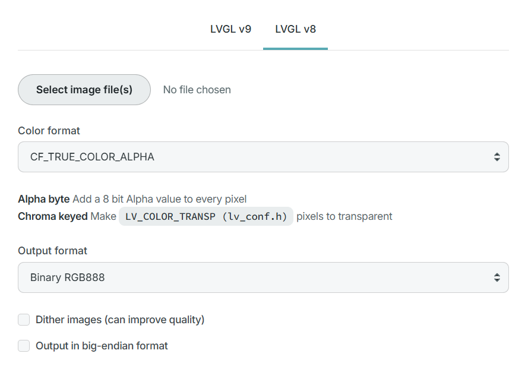

# Mi Band 9 Pro Lua 表盘插件示例

本项目是基于 **LuaVGL** 开发的小米手环 9 Pro Lua 表盘插件示例。

### 核心特性
- **重力感应交互 (G-Sensor)**：支持重力感应的多图层视差动画效果。
- **渐变壁纸 (Gradient Wall)**：支持点击或传感器触发的平滑背景切换动画。
- **待机动画 (Idle Animation)**：高性能的待机图片轮播模板，支持平滑渐变过渡特效与点击关闭交互。
- **亮屏渐显 (Fade Bright)**：全局屏幕唤醒时的优雅渐亮过渡效果。

### 项目结构
- `src/`: 各个表盘项目的核心源代码。
    - `G-Sensor/`: 基于加速度计的视差效果。
    - `gradient-wall/`: 点击切换或传感器触发的图库。
    - `IdleAnimation/`: 支持渐变过渡特效的待机图片轮播/动画开发模板。
    - `fade-bright/`: 全局亮屏渐显遮罩动画模块。

### 快速上手
1. **前置准备**：
   - 下载 [EasyFace](https://github.com/m0tral/EasyFace) 工具。
   - 准备图片资源（参考尺寸：小米手环 9 Pro 为 336x480）。
2. **资源转换**：
   - 使用 [LVGL 在线转换工具](https://lvgl.io/tools/imageconverter) 将 PNG 转换为 `.bin`。
   - 转换器参数参考下图：
     
3. **部署测试**：
   - 将转换后的 `.bin` 文件放到相应文件夹中，对应代码的资源文件 bin 路径。
   - 使用 EasyFace 捣鼓编译。

### 开源协议
本项目采用 [AGPL-3.0 License](LICENSE) 协议。

### 参考文档
- [开发文档](https://github.com/FangAiden/Vela_Application_Documentation)